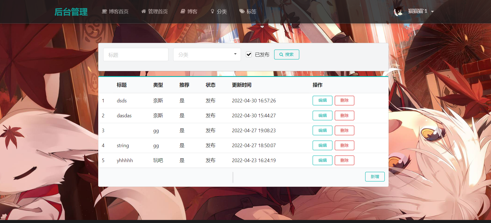

#  基于SpringBoot的个人博客2.0
 **个人博客项目，代码重构中。
目前已完成后台的部分。** 

请求接口restful风格+Swagger接口文档
我抛弃了thymeleaf模板，前端使用完全的ajax请求获取数据。
前后端分离的效果。

* 全局处理异常
* AOP注解实现的：日志打印，登录校验，幂等性校验
* 全局返回统一封装的json数据 
{
    code:200,
    massage: "String",
    obj: Object
}
* ...

## 1.涉及技术及工具

*  **核心框架：SpringBoot** 
*  **MyBatis 框架：mybatis-plus** 
*  **MVC 框架：Spring MVC** 
*  **编译辅助插件：Lombok** 
*  **数据库：MySQL 8.0** 
*  **缓存： redis**
*  **接口文档：swagger**
*  **前端：
    CSS 框架：semantic
              animate
              layer
    Markdown 编辑器：Editor.md** 

## 2.文件结构
```
blog
─src
    ├─main
       ├─java
       │  └─com
       │      └─zry
       │          ├─comment
       │          │  ├─annotations
       │          │  ├─aop
       │          │  │  ├─aspect
       │          │  │  └─exception
       │          │  │      └─handler
       │          │  ├─config
       │          │  ├─idempotent
       │          │  │  └─strategy
       │          │  │      └─impl
       │          │  ├─interceptor
       │          │  ├─respBean
       │          │  └─utils
       │          ├─controller
       │          │  └─admin
       │          ├─dto
       │          ├─entity
       │          ├─mapper
       │          └─service
       │              └─impl
       └─resources
           ├─i18n
           ├─mapper
           ├─static
```

# 预览图：

