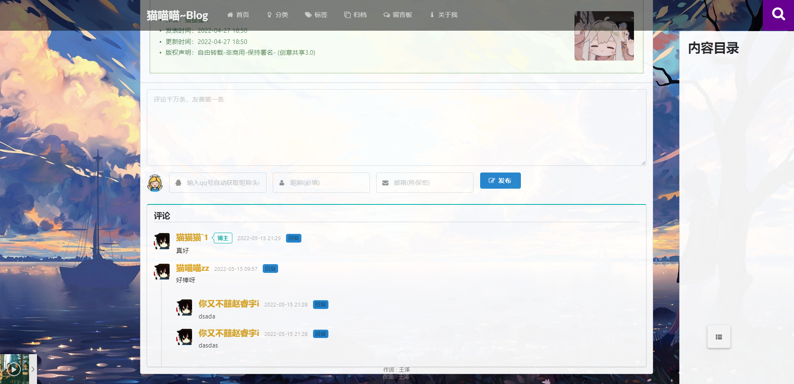

#  基于SpringBoot的个人博客2.0

看完如果觉得还行，给个star鼓励一下吧👍

## 预览地址 http://www.tyux.top/
## 后台地址 http://www.tyux.top/back/login.html  
## 测试用户 用户名：test  密码：1111
## 接口文档地址  http://www.tyux.top/swagger-ui.html

1.  **后台接口restful风格** 

2.  **响应式页面支持移动版** 
3.  **集成swagger接口文档** 
4.  **完善的代码注释** 
5.   **策略模式+redis+自定义注解实现的接口幂等性校验** 

6.  **难度适中，非常适合专注后端的同学学习** 

前端是移动端适配的，使用ajax请求后台数据，然后用jq渲染。
达到前后端分离的目的。（因为不会vue  大哭~）

# 关于部署：

1. 修改配置yml文件，配置好mysql和redis数据库连接。
2. 确保您的数据库中存在SimpleBlog库 。详细sql请看SimpleBlog.sql

3. 启动项目。项目jpa自动生成表结构，并自动初始化 **留言板数据** 和 **用户数据** 。

（自动初始化失败的话：表结构跟必要数据 请看SimpleBlog.sql或者给我留言）

## 1.涉及技术及工具

|  后端 |    |
|---|---|
|  核心框架 | SpringBoot  |
|  持久层 |  mybatis-plus |
|  MVC | Spring MVC  |
| 辅助插件  | Lombok  |
| 数据库  |  MySQL8.0 |
| 中间件  | redis  |
| 接口文档  | swagger  |

前端主要是html页面：
- semantic-UI + layer
- JS框架：Jquery
插件：
- css动画：animate     
- Markdown 编辑器：Editor.md
- 代码高亮（Prism）
- 还有其它有意思的插件 ...

## 2.整体设计与功能
请求接口restful风格+Swagger接口文档
抛弃了thymeleaf模板，前端使用完全的ajax请求获取数据，（/pages/下的html文件）
达到前后端分离的效果。

*  **全局处理异常** 
*  **AOP自定义注解：日志打印，登录校验，幂等性校验** 
*  **策略模式 + 自定义注解 + redis 实现的幂等性校验。** 

*  **全局返回统一封装的json数据格式** 

 **{
    code:200,
    msg: "String",
    data: 数据
}** 

* ...

你完全可自己设计替换其它实现方式。
用户登录流程：

### 主要功能

博客前台
- 博客展示
- 博客分类
- 博客标签
- 时间线
- 博客留言
- 留言邮件通知

博客后台
- 管理员登录
- 写文章
- 修改文章
- 删除文章
- 标签管理
- 分类管理
- 个人信息管理
# 3.文件结构

# 4.预览图：
## 前台：
### 主页

### 文章浏览页面

### 分类页面

### 标签页面

### 归档页面

### 评论区
未登录显示

登陆后显示

## 后台：
### 博文管理页面
